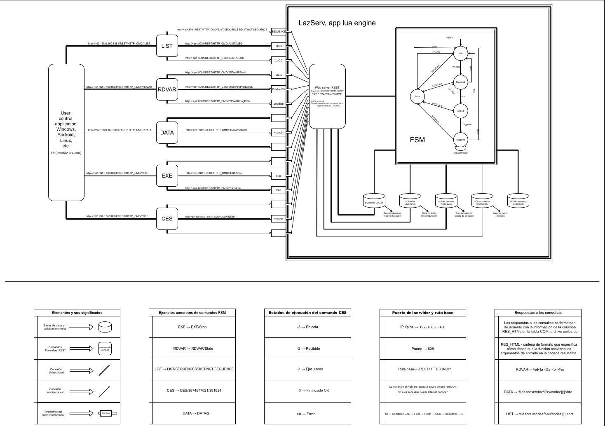

# PG401 Control Interface (PyQt6)

Interfaz de escritorio desarrollada en Python con PyQt6 para el control remoto del sistema PG401 a través del servidor FSM (Finite State Machine) de EKSPLA.  
Permite ejecutar comandos HTTP sobre la red local (LAN), visualizar el estado del sistema láser y registrar logs de eventos.

---

## Estructura del proyecto

```bash
pg401_pyqt/
├── main.py
├── ui/
│ └── main_window.py
├── controller/
│ └── laser_api.py
├── utils/
│ └── logger.py
├── assets/
│ ├── logo.png
│ ├── icons/
│ └── styles/
├── requirements.txt
├── pdf
└── README.md
```
---

## Requisitos

- Python 3.8 o superior
- PyQt6
- requests

Instalá todas las dependencias con:

```bash
pip install -r requirements.txt
```
---

## Cómo ejecutar

```bash
python main.py
``` 
---

## Comunicación con el sistema PG401
Esta aplicación se conecta al servidor REST interno del sistema láser PG401, a través de una red LAN privada. Los comandos utilizados incluyen:

EXE — Ejecutar secuencias (ej: Fire, Stop)
RDVAR — Leer variables del sistema (ej: estado actual)
LIST — Listar secuencias disponibles
CES — Consultar el estado de ejecución de un comando
DATA — Leer datos crudos de sensores

Todos los comandos son enviados en formato RESTful al servidor http://<ip_del_laser>:8081/REST/HTTP_CMD/?.

---

## Notas
Asegurate de estar conectado a la red local del sistema láser (LAN).
El acceso a los datos depende de tener habilitada la IP del cliente en la red.
El log de eventos se guarda automáticamente para trazabilidad y diagnóstico.

---

## Resumen técnico del proyecto


---

## Autor
Daián Giménez García

UNC famaf

daian.gimenez@mi.un.edu.ar


